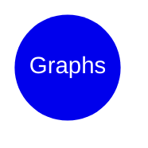
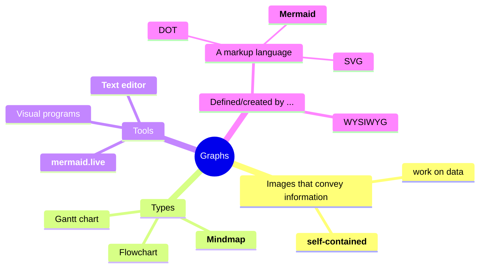
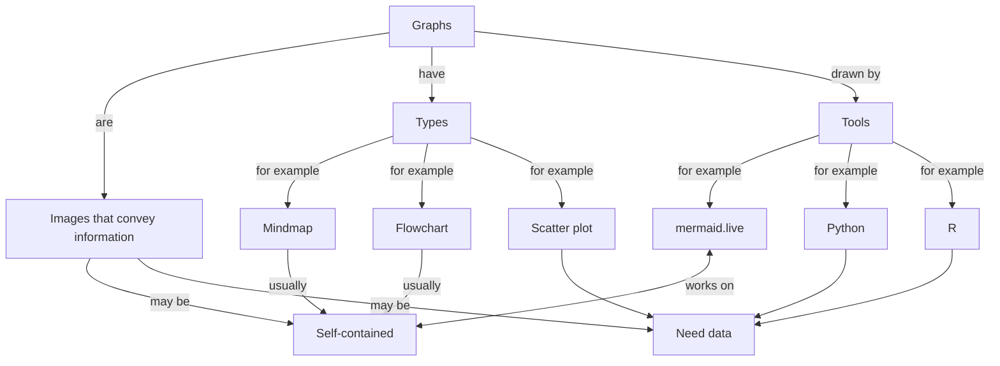

# Lesson on mermaid

> [!NOTE]
>
> Learning objectives:
>
> - Learners understand what Mermaid is
> - Learners have practiced with the Mermaid editor to create a mindmap
> - Learners have practiced with the Mermaid editor to create a flowchart
> - Learners have uploaded a Mermaid diagram to a GitHub README.md file
> - Learners have improved the layout of a flowchart using subgraphs

For teachers

 

```mermaid
gantt
  title Lesson plan
  dateFormat X
  axisFormat %s
  section Lecturing
  This lesson : 0, 5
  What is Mermaid? : 5, 10
  Exercise procedure: 10, 15
  Feedback : 25, 30
  How to use on GitHub : 30, 40
  Exercise procedure: 40, 45
  Feedback : 60, 70
  Subdiagrams : 70, 75
  Feedback : 85, 90
  section Exercise
  Try mermaid.live: 15, 25
  Upload a mermaid diagram: 45,60
  Create a subdiagram: 75,85
```

Lesson plan:

- Who I am
- Cycle 1:
  - Prior knowledge:
    - What do you associate the word 'diagram' with?
    - What types of diagrams are there? Mention mindmap and flowchart
    - How to create diagrams?
    - How to publish diagrams?
    - What is a mindmap?
    - How to create a mindmap?
  - Present: go to <mermaid.live>, show mindmap, show syntax
  - Challenge: exercise 1
  - Feedback: 
    - ask 1 random learner to show mindmap, else show mine
    - ask drawback of mindmaps. Cannot link between nodes
- Cycle 2:
  - Prior knowledge:
    - What do you associate the word 'flowchart' with?
    - How to create a flowchart?
  - Present: 
    - what is mermaid?
    - why use mermaid?
    - go to <mermaid.live>, show flowchart, show syntax
  - Challenge: exercise 2
  - Feedback: ask 1 random learner to show mindmap

## Theory 1: introduction

Mermaid is a markup language to create graphs.

Instead of talking about it, let's experience Marmaid first.

## Exercise 1: first experience with Mermaid

Learning objectives

 
- Learners get a first impression of what Mermaid is
- Learners have practiced with the Mermaid editor
- Learners may have seen a technical error

What do you associate with the word 'graphs'?

- Go to [https://mermaid.live](https://mermaid.live) 
- Click on 'Sample Diagrams' then click 'Mindmap'
- Modify the mindmap so that the word 'Graphs' is at the center
- Modify the mindmap so that it shows your associations with the word 'graphs' visually
- (optional) visit [the mermaid documentation on mindmaps](https://mermaid.js.org/syntax/mindmap.html)

Questions:

- What are features of a Mermaid mindmap?
- (optional) What happens if you do use the word `mindmap` in your mindmap?
- (optional) Are there characters forbidden, such as `.`, `!`, `[` or `(`?

Need a video?

 

Here is a video of someone doing this exercise: [https://youtu.be/tObmaZp3fIg](https://youtu.be/tObmaZp3fIg)

Possible answers

 

> What are features of a Mermaid mindmap?

A mermaid mindmap starts with a first line that has text `mindmap`,
after which all other elements are indented.

The first element is the center node, called `root`. Between
round braces is the text on the center node. Changing this line to
`root((Graphs))` puts the word 'Graphs' in the center.

Other elements are indented at least twice and follow a tree-like structure.
This tree-like structure is the same as the mindmap.

One cannot determine where the nodes will end up.
This is a feature of a markup language: 
the idea is to have a good-enough mindmap,
not to be able to create publication-ready ones.

> - (optional) What happens if you do use the word `mindmap` in your mindmap?

You will get an error, as `mindmap` is a word that Mermaid reserves for
indicating that a graph will be of the mindmap type.

> - (optional) Are there characters forbidden, such as `.`, `!`, `[` or `(`?

You will get an error for `[` and `(`, as Mermaid uses these operators
for special markup.

My associations with the word 'graphs' as a mindmap

 

## Theory 2: terminology

Mermaid is a markup language to create graphs.

A 'markup language' is a language that describes the markup of something.
In case of a mindmap, the Mermaid markup language uses indentation
to indicate the structure of the mindmap.

The [https://mermaid.live](https://mermaid.live) website is an online editor 
with direct visualization.

## Exercise 2: first experience with Mermaid

> [!NOTE]
>
> Learning objectives:
>
> - Learners understand what Mermaid is
> - Learners have practiced with the Mermaid editor

What do you associate with the word 'graph'?

Go to <mermaid.live> and create a flowchart. 
- If needed, visit [the Mermaid documentation on flowcharts](https://mermaid.js.org/syntax/flowchart.html)
Avoid using the word `flowchart`.
On the edges, describe the relationships between the concepts.

What are features of a Mermaid flowchart?

My associations with the word 'graph' as a flowchart

 

### Exercise 3

> [!NOTE]
>
> Learning objectives:
>
> - Learners understand what Mermaid is
> - Learners have practiced with the Mermaid editor
> - Learners have uploaded a Mermaid diagram to a GitHub README.md file

### [Extra] Exercise 4

> [!NOTE]
>
> Learning objectives:
>
> - Learners understand what Mermaid is
> - Learners have practiced with the Mermaid editor
> - Learners have uploaded a Mermaid diagram to a GitHub README.md file
> - Learners have improved the layout of a flowchart using subgraphs

## Links

- [Mermaid homepage](https://mermaid.js.org/)
- [NOTE testing](https://github.com/sinsukehlab/NOTE-test/blob/main/NOTE.md)
- [Dropdown tests](https://gist.github.com/citrusui/07978f14b11adada364ff901e27c7f61)
