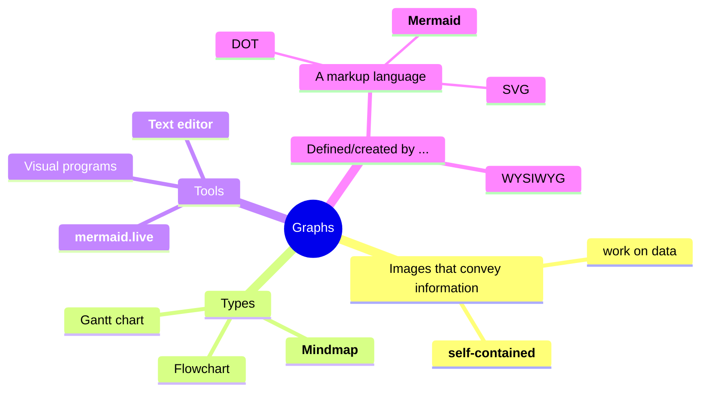
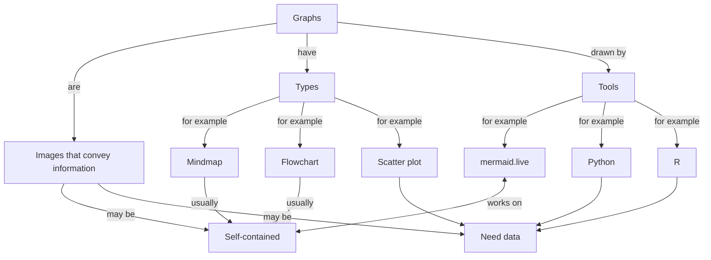

# lesson_mermaid

> [!NOTE]
>
> Learning objectives:
>
> - Learners understand what Mermaid is
> - Learners have practiced with the Mermaid editor to create a mindmap
> - Learners have practiced with the Mermaid editor to create a flowchart
> - Learners have uploaded a Mermaid diagram to a GitHub README.md file
> - Learners have improved the layout of a flowchart using subgraphs

For teachers

 

```mermaid
gantt
  title Lesson plan
  dateFormat X
  axisFormat %s
  section Lecturing
  This lesson : 0, 5
  What is Mermaid? : 5, 10
  Exercise procedure: 10, 15
  Feedback : 25, 30
  How to use on GitHub : 30, 40
  Exercise procedure: 40, 45
  Feedback : 60, 70
  Subdiagrams : 70, 75
  Feedback : 85, 90
  section Exercise
  Try mermaid.live: 15, 25
  Upload a mermaid diagram: 45,60
  Create a subdiagram: 75,85
```

Lesson plan:

- Who I am
- Cycle 1:
  - Prior knowledge:
    - What do you associate the word 'diagram' with?
    - What types of diagrams are there? Mention mindmap and flowchart
    - How to create diagrams?
    - How to publish diagrams?
    - What is a mindmap?
    - How to create a mindmap?
  - Present: go to <mermaid.live>, show mindmap, show syntax
  - Challenge: exercise 1
  - Feedback: 
    - ask 1 random learner to show mindmap, else show mine
    - ask drawback of mindmaps. Cannot link between nodes
- Cycle 2:
  - Prior knowledge:
    - What do you associate the word 'flowchart' with?
    - How to create a flowchart?
  - Present: 
    - what is mermaid?
    - why use mermaid?
    - go to <mermaid.live>, show flowchart, show syntax
  - Challenge: exercise 2
  - Feedback: ask 1 random learner to show mindmap

## Introduction

### My associations with the word 'graph' as a mindmap

### My associations with the word 'graph' as a flowchart

## Exercises

### Exercise 1

> [!NOTE]
>
> Learning objectives:
>
> - Learners get a first impression of what Mermaid is
> - Learners have practiced with the Mermaid editor

What do you associate with the word 'graph'?

Go to <mermaid.live> and create a mindmap. Avoid using the word `mindmap`.

What are features of a Mermaid mindmap?

### Exercise 2

> [!NOTE]
>
> Learning objectives:
>
> - Learners understand what Mermaid is
> - Learners have practiced with the Mermaid editor

What do you associate with the word 'graph'?

Go to <mermaid.live> and create a flowchart. Avoid using the word `flowchart`.
On the edges, describe the relationships between the concepts.

What are features of a Mermaid flowchart?

### Exercise 2

> [!NOTE]
>
> Learning objectives:
>
> - Learners understand what Mermaid is
> - Learners have practiced with the Mermaid editor
> - Learners have uploaded a Mermaid diagram to a GitHub README.md file

### [Extra] Exercise 3

> [!NOTE]
>
> Learning objectives:
>
> - Learners understand what Mermaid is
> - Learners have practiced with the Mermaid editor
> - Learners have uploaded a Mermaid diagram to a GitHub README.md file
> - Learners have improved the layout of a flowchart using subgraphs

## Links

- [Mermaid homepage](https://mermaid.js.org/)
- [NOTE testing](https://github.com/sinsukehlab/NOTE-test/blob/main/NOTE.md)
- [Dropdown tests](https://gist.github.com/citrusui/07978f14b11adada364ff901e27c7f61)
