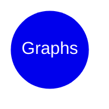
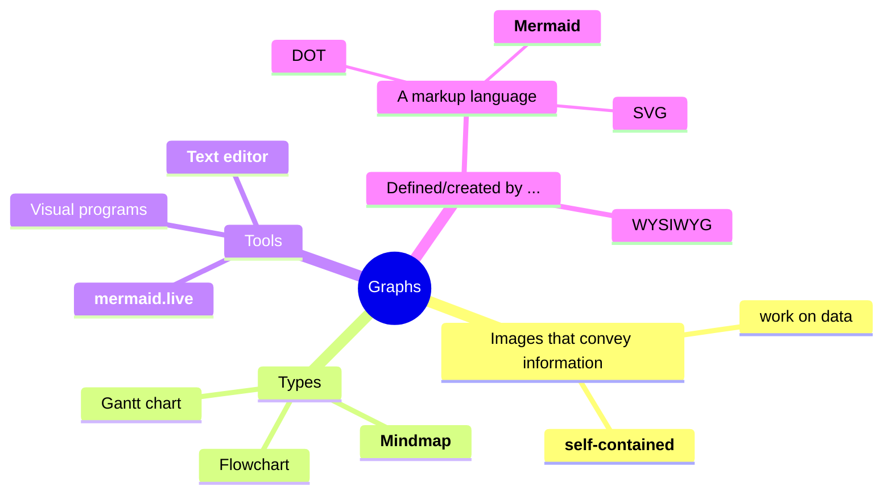
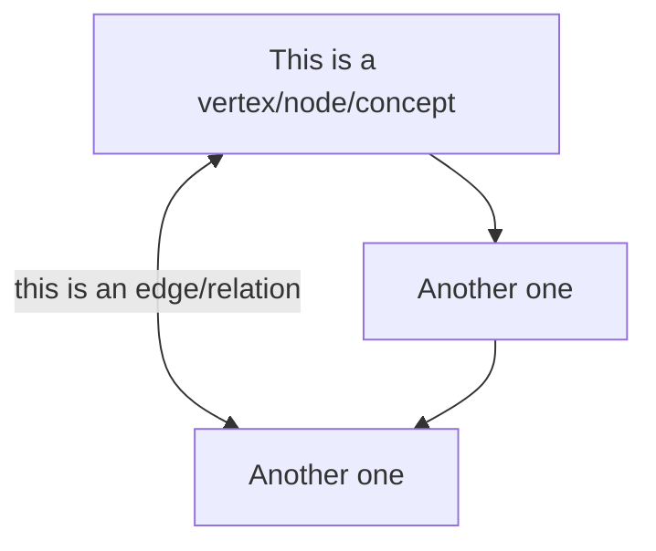
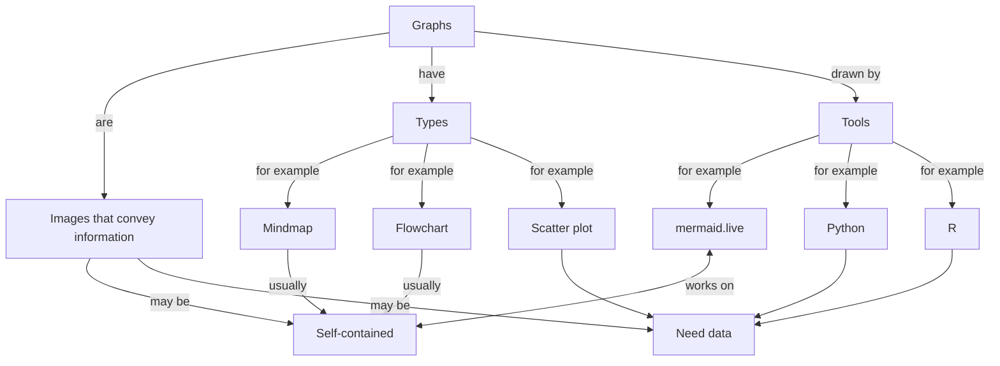

# Lesson on mermaid

> [!NOTE]
>
> Learning objectives:
>
> - Learners understand what Mermaid is
> - Learners have practiced with the Mermaid editor to create a mindmap
> - Learners have practiced with the Mermaid editor to create a flowchart
> - Learners have uploaded a Mermaid diagram to a GitHub README.md file
> - Learners have improved the layout of a flowchart using subgraphs

<details>
<summary>For teachers</summary>
<br>



Lesson plan:

- Who I am
- Cycle 1:
  - Prior knowledge:
    - What do you associate the word 'diagram' with?
    - What types of diagrams are there? Mention mindmap and flowchart
    - How to create diagrams?
    - How to publish diagrams?
    - What is a mindmap?
    - How to create a mindmap?
  - Present: go to <mermaid.live>, show mindmap, show syntax
  - Challenge: exercise 1
  - Feedback: 
    - ask 1 random learner to show mindmap, else show mine
    - ask drawback of mindmaps. Cannot link between nodes
- Cycle 2:
  - Prior knowledge:
    - What do you associate the word 'flowchart' with?
    - How to create a flowchart?
  - Present: 
    - what is mermaid?
    - why use mermaid?
    - go to <mermaid.live>, show flowchart, show syntax
  - Challenge: exercise 2
  - Feedback: ask 1 random learner to show mindmap

</details>

## Overview

- [Theory 1: introduction](#theory-1-introduction)
- [Exercise 1: first experience](#exercise-1-first-experience) 
- [Theory 2: terminology](#theory-2-terminology) 
- [Exercise 2: a Mermaid flowchart](#exercise-2-a-flowchart) 
- [Theory 3: publishing graphs](#theory-3-publishing-graphs)
- [Exercise 3: publish a graph](#exercise-3-publish-a-graph)
- (optional) [Theory 4: improving layout](#theory-4-improving-layout)
- (optional) [Exercise 4: improve layout](#exercise-4-improve-layout)

## Theory 1: introduction

Mermaid is a markup language to create graphs.

Instead of talking about it, let's experience Marmaid first.

## Exercise 1: first experience

<details>
<summary>Learning objectives</summary>
<br>

- Learners get a first impression of what Mermaid is
- Learners have practiced with the Mermaid editor
- Learners may have seen a technical error

</details>




What do you associate with the word 'graphs'?

- Go to [https://mermaid.live](https://mermaid.live) 
- Click on 'Sample Diagrams' then click 'Mindmap'
- Modify the mindmap so that the word 'Graphs' is at the center
- Modify the mindmap so that it shows your associations with the word 'graphs' visually
- (optional) visit [the mermaid documentation on mindmaps](https://mermaid.js.org/syntax/mindmap.html)

Questions:

- What can you express in a Mermaid mindmap?
- What can you not express in a Mermaid mindmap?
- (optional) What happens if you do use the word `mindmap` in your mindmap?
- (optional) Are there characters forbidden, such as `.`, `!`, `[` or `(`?

<details>
<summary>Need a video?</summary>
<br>

Here is a video of someone doing this exercise: [https://youtu.be/tObmaZp3fIg](https://youtu.be/tObmaZp3fIg)

</details>

<details>
<summary>Possible answers</summary>
<br>

> What can you express in a Mermaid mindmap?

A Mermaid mindmap allows one to create a tree-like structure
of vertices/nodes/concepts in an outwards way. 

> What can you not express in a Mermaid mindmap?

One cannot add links between concepts.
One cannot determine where the nodes will end up.

> (optional) What happens if you do use the word `mindmap` in your mindmap?

You will get an error, as `mindmap` is a word that Mermaid reserves for
indicating that a graph will be of the mindmap type.

> (optional) Are there characters forbidden, such as `.`, `!`, `[` or `(`?

You will get an error for `[` and `(`, as Mermaid uses these operators
for special markup.

</details>

## My associations with the word 'graphs' as a mindmap



## Theory 2: terminology

Mermaid is a markup language to create graphs.

A markup language is a language that describes the markup of something.
In case of a mindmap, the Mermaid markup language uses indentation
to indicate the structure of the mindmap.

The [https://mermaid.live](https://mermaid.live) website is an online editor 
with direct visualization.

Mermaid will do the layout for you.
Options to decide upon the layout are absent or limited. 
This is a strength: you **should** let Mermaid do the layout for you,
as the goal is to create graphs quickly, not to create graphs for publication.

A mindmap is a graph that does not have relations between its 
nodes/vertices/concepts. 
For complex information, however, one would enjoy to express this
by adding edges/relations.
A mermaid flowchart allows one to create graphs of a complex structure.



## Exercise 2: a flowchart

<details>
<summary>Learning objectives</summary>
<br>

- Learners understand what Mermaid is
- Learners have practiced with the Mermaid editor

</details>

What do you associate with the word 'graph'?

- Go to [https://mermaid.live](https://mermaid.live) 
- Click on 'Sample Diagrams' then click 'Flow'
- Modify the flowchart so that the word 'Graphs' is at the center
- If needed, visit [the Mermaid documentation on flowcharts](https://mermaid.js.org/syntax/flowchart.html)
- (optional) On the edges, describe the relationships between the concepts.

Questions:

- What can you express in a Mermaid flowchart?
- What can you not express in a Mermaid flowchart?

<details>
<summary>Possible answers</summary>
<br>

> What can you express in a Mermaid flowchart?

A Mermaid flowchart allows one to create a complex structure
of vertices/nodes/concepts in any way

> What can you not express in a Mermaid flowchart?

One cannot determine where the nodes will end up.

</details>

<details>
<summary>My associations with the word 'graph' as a flowchart</summary>
<br>



</details>


## Theory 3: publishing graphs

Mermaid is a markup language to create graphs.

One probably wants to share these graphs.

GitHub is a website primarily to host code.
It is the current most popular code hosting website
and host more than only code.
Per project, a typical user creates one website, 
called a GitHub repository.
All GitHub repositories are version controlled,
i.e. one can always go back in history to recover
(older versions of) files.

## Exercise 3: publish a graph

<details>
<summary>Learning objectives</summary>
<br>

- Learners understand what Mermaid is
- Learners have practiced with the Mermaid editor
- Learners have uploaded a Mermaid diagram to a GitHub README.md file

</details>

Here we publish a Mermaid graph on GitHub.
In this exercise, the graph is unimportant: pick your favorite :-)

- Create a GitHub account
- Create a new GitHub repository and add a check to 'Create README.md'
- Your own GitHub repository now shows its `README.md` file
- Edit the file `README.md`
- In the editor, put your Mermaid markdown in a Mermaid code block, 
  like this website does:

    ```mermaid
    [your mermaid code here]
    ```
- Click on 'Commit'
- Refresh the website: it shows your Mermaid graph!

## Theory 4: improving layout

### Exercise 4: improve layout

<details>
<summary>Learning objectives</summary>
<br>

- Learners understand what Mermaid is
- Learners have practiced with the Mermaid editor
- Learners have uploaded a Mermaid diagram to a GitHub README.md file
- Learners have improved the layout of a flowchart using subgraphs

```mermaid
gantt
  title Lesson plan
  dateFormat X
  axisFormat %s
  section Lecturing
  This lesson : 0, 5
  What is Mermaid? : 5, 10
  Exercise procedure: 10, 15
  Feedback : 25, 30
  How to use on GitHub : 30, 40
  Exercise procedure: 40, 45
  Feedback : 60, 70
  Subdiagrams : 70, 75
  Feedback : 85, 90
  section Exercise
  Try mermaid.live: 15, 25
  Upload a mermaid diagram: 45,60
  Create a subdiagram: 75,85
```

</details>

## Links

- [Mermaid homepage](https://mermaid.js.org/)
- [NOTE testing](https://github.com/sinsukehlab/NOTE-test/blob/main/NOTE.md)
- [Dropdown tests](https://gist.github.com/citrusui/07978f14b11adada364ff901e27c7f61)
