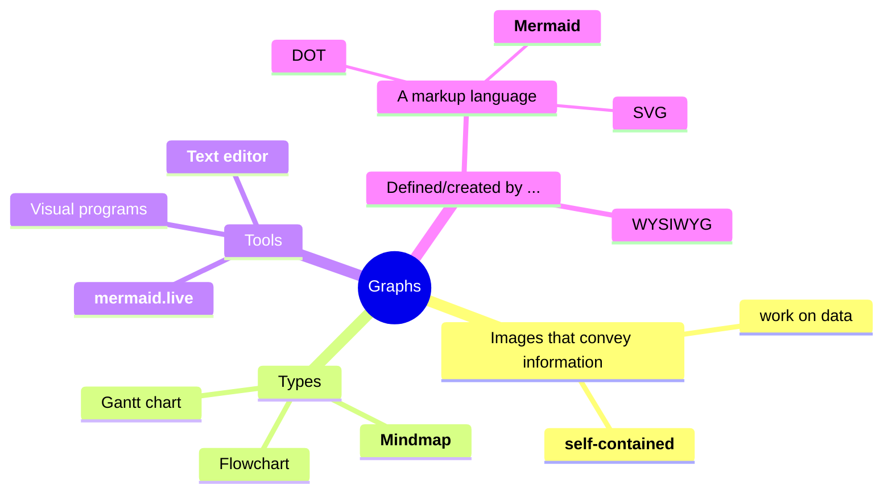

# lesson_mermaid

For teachers

 

Learning objectives:

- Learners understand what Mermaid is
- Learners have practiced with the Mermaid editor
- Learners have uploaded a Mermaid diagram to a GitHub README.md file
- Learners have improved the layout of a flowchart using subgraphs

```mermaid
gantt
  title Lesson plan
  dateFormat X
  axisFormat %s
  section Lecturing
  This lesson : 0, 5
  What is Mermaid? : 5, 10
  Exercise procedure: 10, 15
  Feedback : 25, 30
  How to use on GitHub : 30, 40
  Exercise procedure: 40, 45
  Feedback : 60, 70
  Subdiagrams : 70, 75
  Feedback : 85, 90
  section Exercise
  Try mermaid.live: 15, 25
  Upload a mermaid diagram: 45,60
  Create a subdiagram: 75,85
```

Lesson plan:

- Prior knowledge:
  - How to create diagrams quickly?
  - How to create diagrams in text quickly?
  - How to create diagrams in text quickly that you can upload?

## Introduction

My associations with the word 'graph'

 

## Links

- [Mermaid homepage](https://mermaid.js.org/)
