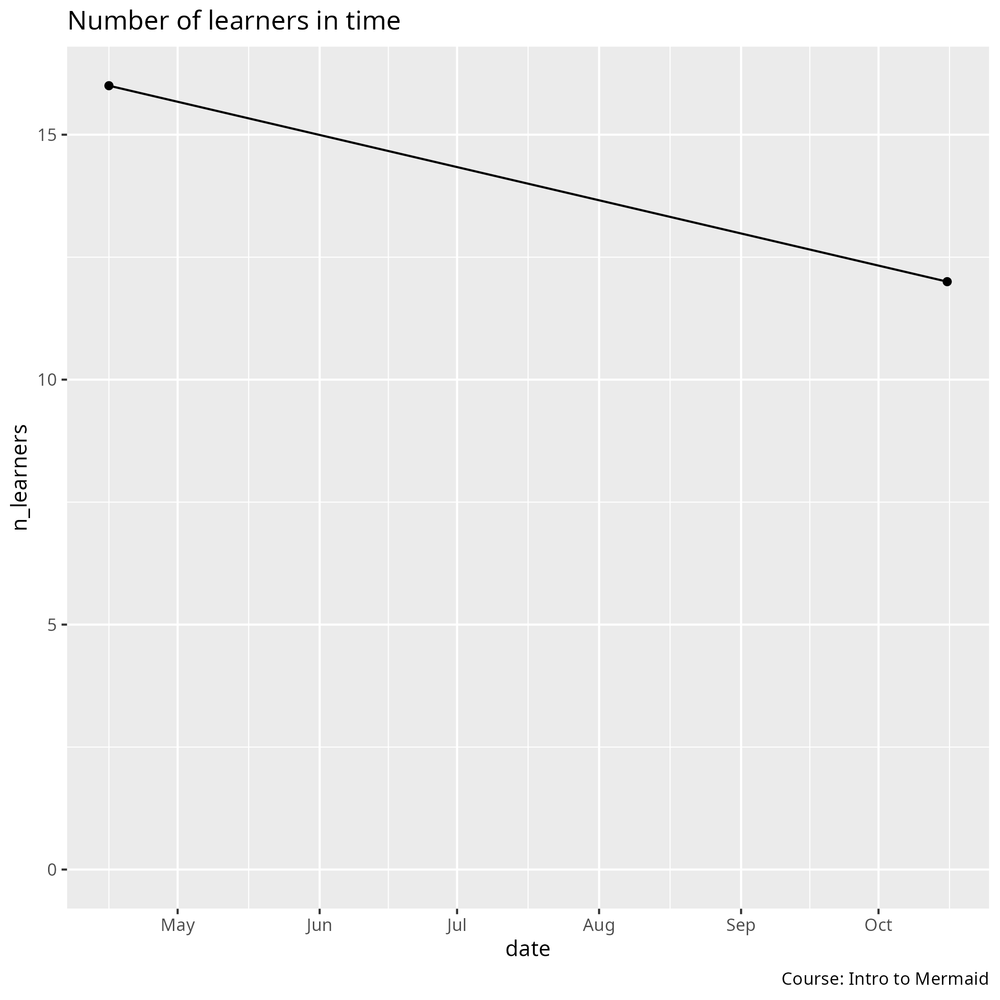

# Data

Data on this course.

## [n_learners_per_event.csv](n_learners_per_event.csv)

The number of learners per event.

Field       |Description
------------|--------------------------
`date`      |Date, in `YYYYMMDD` format
`n_learners`|The number of learners. This excludes the teacher(s) and teaching assistant(s)

