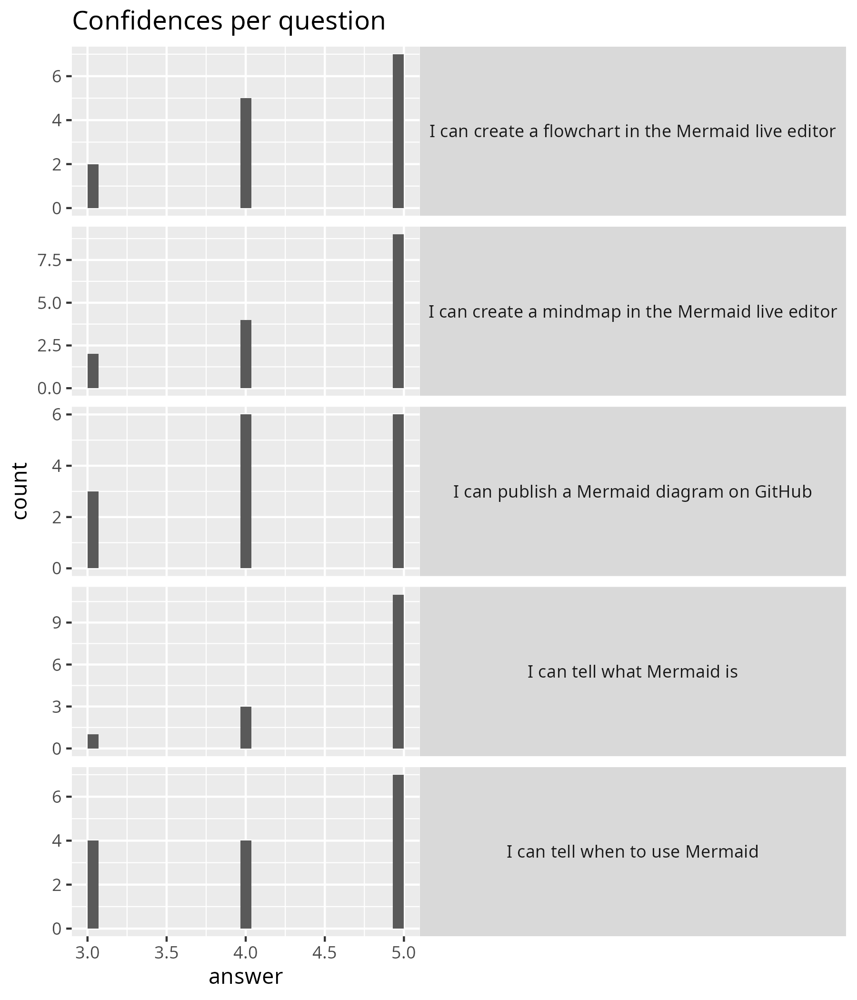

# Evaluation 2025-04-10

- [Lesson plan](../../lesson_plans/20250410/README.md)
- [Evaluation](../../evaluations/20250410/README.md)
- [Reflection](../../reflections/20250410/README.md)
- [Success score](success_score.txt): 88%
- Number of learners: 15
- Number of evaluation responses: 15 (100%)

Below are the evaluation results.

## Anonymous feedback

There was none.

## Course evaluation results

)

[Other feedback](other_feedback.txt):

- Nice course, great energy :)
- is nice to do exercises together, they were well planned and organised.
  much better than a boring ppt
- I have enjoyed this course.
  I have learned to use different softwares and improved in my visual
  presentations. I would recommend this course to other PhD students.
- Great way to learn about this tool!
  I think it could maybe be improved by
  making it more relevant to our own research.
- It is a really useful course, and interactive.
- Great session! it was very dynamic and hands on.
  The instructor's teaching style is also very nice.
- Interactive session. Like it!
- Nice and clear structure. Enough time for most exercises.
  I like the small break-out rooms.
  No need to explicitly suggest how to interact in the break out rooms.
  I understand the wish for people to turn on camera
  but would prefer it to be voluntary still.

## [KI feedback results](ki_feedback_results.pdf)

### 16. Were there any parts of the course that were excellent? If so, please specify which parts and in what way.

- I especially liked the setting with break out rooms and small drawing tasks
  to engage people! You managed to have us build a connection as a
  group, even though it is harder over zoom!
  The size of the group also helped with that I suppose.
  Also, I liked to mostly have the teaching in the morning
  and working on our own in the afternoon.
  I think the feedback sessions went really well and
  I was surprised that I could give (hopefully)
  useful feedback to class mates even though I did
  not necessarily understand their research very well.
  That proved to me that you did a really good job teaching us
  the skill of critically assessing
  visuals! :)
- We have time to explore the software and make graphical
  abstract and figures for our own project.
- The type of exercises, the pace of the course + the constant feedback
  led to aquiring an actual skill, that we can use for our projects.
  Illustrating can be chaotic in the beggining,
  especially with specific softwares,
  so this course helped having a clear view on where to begin.
  Also, this course provided enough material for future need,
  in case we need help on this topic.
- This was the best full online course I have had.
  The amount of interaction was great,
  so please keep these discussion/break out sessions in
  the course.
- The teachers were excellent and actively tried to make the content engaging
  (even the coding!). 
  The teachers were very reachable by slack
  too. I learnt valuable knowledge in how to apply design principles
  to communicate my science. I like how we have each other feedback and we
  also got feedback from the teachers too.
- Very interesting and fun course,
  Meike were highly engaged and really offered to help
  and provide feedback continuously during the course!
- Two of the lectures i particularly enjoyed and were excellent.
  I also enjoyed the examination format, as it was both useful for our work,
  while also being part of the course
- Everything was great!
  This was definitely the best course I have followed at KI!
  I liked the balance between lectures and working by ourselves.
  The lectures were also fun because they were quite interactive
  and the little exercises we did during the lectures
  were very helpful to get in the
  process.
  I got many insights about how to create better visuals and
  it was good to get feedback from the teachers and the other students.
  Although we are all from very different fields,
  it was helpful to understand how others perceive your figures.
  These two weeks flew by and although I had to work on quite some other things
  beside the course, I really enjoyed every minute I spent on
  this course :)
- All the lectures and practice exercises were very well developed
  to improve our skills in scientific illustration and data visualisation.
  I really enjoyed to do the assignments because I could use my own data
  do develop something I could use later on in my publications or
  presentations. It was also fun to know all the logic behind the way our
  brain receive and interpretate an image, and the ways we could improve
  our illustrations for a better communication process.
  Also the use of different softwares and the potential of each one.
  I learned a lot and I am
  very grateful I have the opportunity to take this course on time
  before my first manuscripts submissions.
  I was a little bit reluctant about being
  100% online course, but the way it was conduced, the interactions,
  the management of time for each task made it easier. Congratulations for
  all professionals involved on teaching with high quality in the course.
- I really liked the style of how and when we received feedback
  on the hand ins in the course and how much support was given when working
  on the assignments.
- very practical :)
- Interactive sessions and hands on activities during the session.
- I really enjoyed the Adobe illustrator activities to practice.
  I tried before to learn with youtube videos but it was highly confusing.
  Doing the
  activities like this help to learn how to use the different tools
  in a simple and helpful way.
- Everything about this course was great!
  From the topics to the way it is taught.
  I particularly enjoyed the peer-review and team work sessions
  where the instructors were also coming to check in and
  give input about the task.
  This is one of the best online courses I’ve ever attended.

### 17. Do you have any recommendations as to how the course could be improved? If so, please specify which parts and how.

- Maybe spend more time for Mermaid.
  It was a very interesting tool but in just a short time.
  I also would recommend to keep the course with students
  with different background because I learned a lot from them and
  also received valuable feedback for improving my figures
  (maybe try to keep spreading the word out of KI).
- For me the less useful parts were the introduction to R/ggplot2,
  because I already had some programming background,
  so although I enjoyed the lectures from Martin and Richel,
  it would have been nicer for me to have used that time to work
  on the poster/figures myself.
  Maybe it can be set up more flexible
  that you can choose to which lectures to attend.
- I think it would be nice to have on session in the beginning
  of the second week on how to transform your own data into tidy data
  with which you are able to work in R/ggplot2.
- A recommendation is to implement one or two more lectures
  with a format similar to Martin Jonnson's,
  where we could follow his slides - even later offline - one by one,
  to create a graph.
  My recommendation is to do something similar with a complicated illustration,
  so we can understand even better the process of how to start from
  an empty artboard and end up with a high-quality creative illustration.
- My only critique would be to maybe ask students at the start of the course
  their prior coding knowledge. As in the course information it is written
  like you need R and illustrator.
  But the course is actually completeable with python and Inkscape/designer.
  If there could be some sort of support possible for students
  who prefer python over R that would be great too.
- It might be nice to introduce ggplot data visualisation earlier in week 1,
  so there is a bit more time to learn to work with this programm and
  already get feedback together
  with the graphical abstract at the start of week 2.
- I would have liked to have some more optional
  adobe illustrator activities to do.
- There was a lot to do during the course which required more working hours
  than expected, even though it probably on individual level was up
  to the student to decide when the assignments were "good enough",
  but maybe clarify what is really necessary for the course purpose
  in contrast to individual development and individual choices.
- In general, I really loved to course,
  so this is only small details and a personal feeling!

  I felt like it was quite a lot of submissions...
  but I was also attempting to make a whole poster and
  there was not enough time for that...
  I think it would have been less stressful to submit maybe
  only a rough outline of a poster or graphical abstract
  and then focus on one or two illustrations and make those really nice
  using all the 3D and shading and colouring tools we learned...
  For the feedback I had a hard time understanding the difference between
  first and second feedback person and I think it would be fine
  to just let the first person say whatever comes to mind
  and the second one adding if they have any further comment...
- I feel like the use of adobe/ inkscape could have been better explained.
  The slides that I used were interactive and were good,
  but i had to look at further youtube videos on it as well.
  I liked that there was a variety of choice of software
  at varying price points, but considering i was just starting,
  I used the free choice.
  That was perhaps a bit more limiting in my ability to create something,
  though Im not sure as I did not try the others.
  The last thing I would say is perhaps to put in some examples
  of work that is not so refined and submitted to journals and magazines -
  something that might be a bit more achievable for PhD/ post doc work.
  Most of what we saw was of such high quality that i was inspired by it,
  but had no idea how to achieve that.
- more examples of good scientific illustrations of the most common
  plots -> a good bar graph, regression analysis, correlation matrix,
  heat map, forest plot etc.
- Maybe include one session in person for the people that are in Stockholm
  or that can attend. It would be great to have the last session be
  in person and receive feedback from the others.
- I guess the feedback should also be in written format from peers too.
  It will help the creator to incorporate and select the best suggestions
  from them in the final versions.

