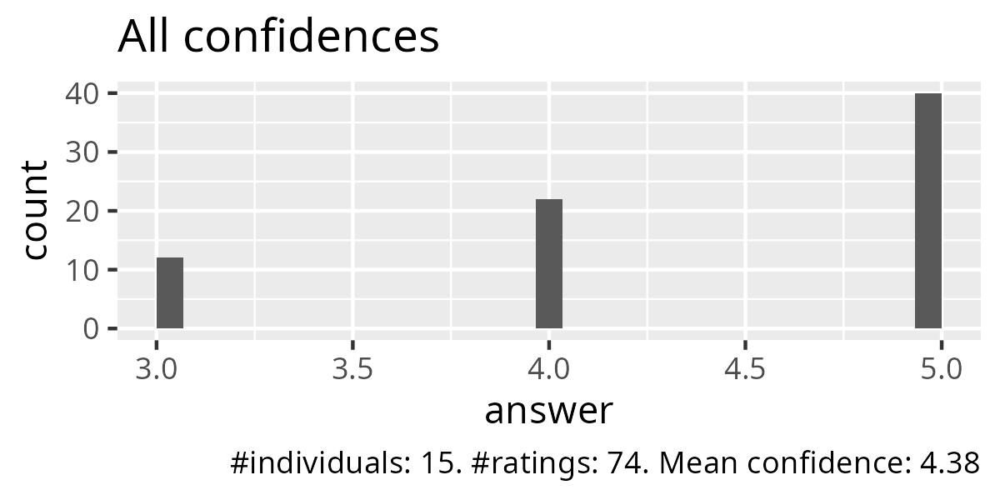

# Evaluation 2025-04-10

- [Lesson plan](../../lesson_plans/20250410/README.md)
- [Evaluation](../../evaluations/20250410/README.md)
- [Reflection](../../reflections/20250410/README.md)
- [Success score](success_score.txt): 88%
- Number of learners: 15
- Number of evaluation responses: 15 (100%)

Below are the evaluation results.

## Anonymous feedback

There was none.

## Course evaluation results

)

