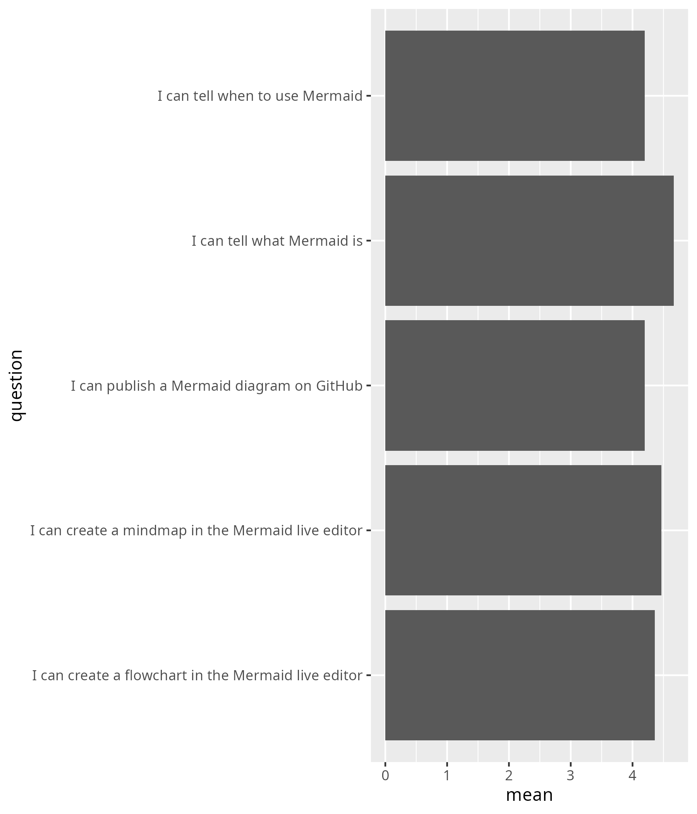

# Evaluation 2025-04-10

- [Lesson plan](../../lesson_plans/20250410/README.md)
- [Evaluation](../../evaluations/20250410/README.md)
- [Reflection](../../reflections/20250410/README.md)
- [Success score](success_score.txt): 88%
- Number of learners: 15
- Number of evaluation responses: 15 (100%)

Below are the evaluation results.

## Anonymous feedback

There was none.

## Course evaluation results

)

[Other feedback](other_feedback.txt):

- Nice course, great energy :)
- is nice to do exercises together, they were well planned and organised.
  much better than a boring ppt
- I have enjoyed this course.
  I have learned to use different softwares and improved in my visual
  presentations. I would recommend this course to other PhD students.
- Great way to learn about this tool!
  I think it could maybe be improved by
  making it more relevant to our own research.
- It is a really useful course, and interactive.
- Great session! it was very dynamic and hands on.
  The instructor's teaching style is also very nice.
- Interactive session. Like it!
- Nice and clear structure. Enough time for most exercises.
  I like the small break-out rooms.
  No need to explicitly suggest how to interact in the break out rooms.
  I understand the wish for people to turn on camera
  but would prefer it to be voluntary still.
