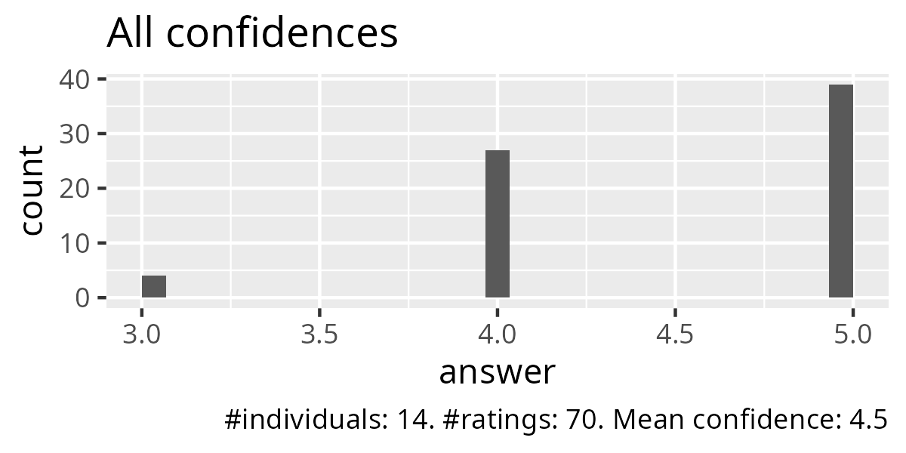
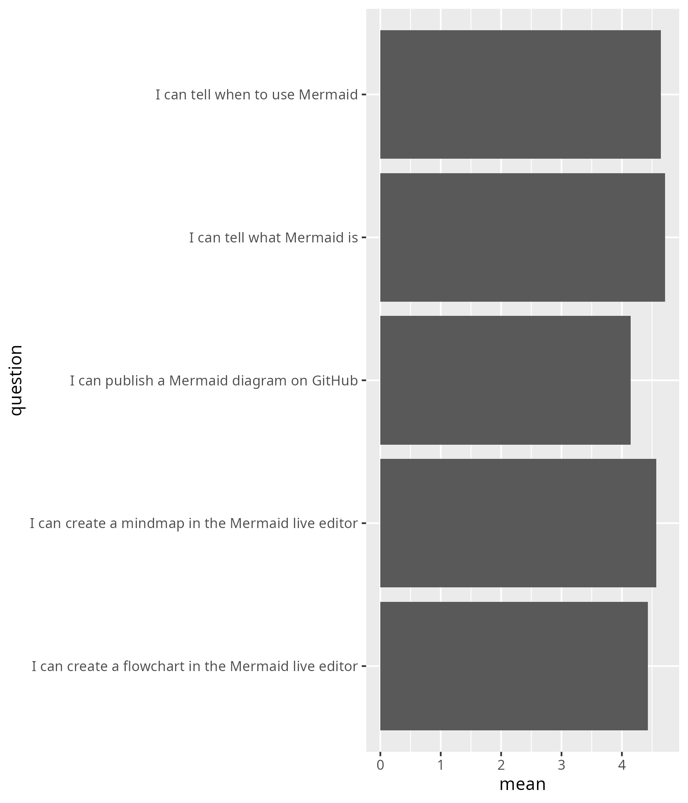
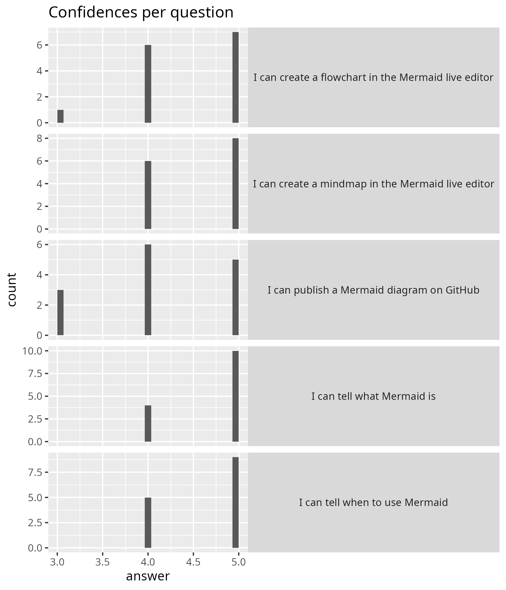

# Evaluation

- [Lesson plan](../../lesson_plans/20251002/README.md)
- [Evaluation](../../evaluations/20251002/README.md)
- [Reflection](../../reflections/20251002/README.md)
- [Success score](success_score.txt): 90%
- Number of learners: 14
- Number of evaluation responses: 14 (100%)

Below are the evaluation results.

## My evaluation

### Anonymous feedback

There was none.

### Course evaluation results

)

[Other feedback](other_feedback.txt):

- Thanks for being so upbeat and friendly:)
- It is great to have to opportunity for some practice
  and to play around with the tool.
- Very active session, it was good to learn in pairs to figure stuff out.
  I almost had an issue with publishing, as the instruction code line
  included [ ] around the code but your demo helped solve this issue.
  Also first time for me to create a repository on GitHub,
  I now understand that better too. Thanks for the session!
- I struggled to change the layout of both the mind map and flow chart
  to align it with my thoughts/ story.

## KTH course evaluation

- [KTH course evaluation results](kth_course_evaluation.pdf)

### 16. Were there any parts of the course that were excellent?

If so, please specify which parts and in what way.
Were there any parts of the course that were excellent?
If so, please specify which parts and in what way

- the course content overall, Meike was a very informative and helpful teacher
- The course was brilliant — very well put together and thoughtfully structured.
  I especially appreciated the software practicals that were especially helpful
  in familiarising us with the tools.
  The lectures were easy to follow, and all concepts were clearly explained.
  They provided a comprehensive and well-structured overview
  of the most important aspects of data visualisation
  and scientific illustration.
  The constant encouragement from Meike and the opportunity
  to receive iterative feedback made a big difference.
  It felt like a supportive learning environment rather than just lectures.
  I now feel inspired and confident to develop visuals and graphical abstracts
  for my research data. Thank you so much!
- Meike's lectures, tutorials and self-study documents in AI/Inkscape.
- Overall the design of the course. You learn a lot from both the teacher,
  your peers, and yourself, which is unique!
  Meike is probably one of the best teachers I’ve ever had.
  She really helps you to look at design as both artist and scientist.
- It was great Meike was open to discussing and having exercises
  for the three major vector illustration programs.
  I valued that flexibility.
  Happy to see the design elements and theory in how to build figures.
- Yes. The most exciting part for me was the projects we had to do.
  They were challenging in a way that pushed me to go out my way
  to finish the text.
  They weren't so easy for me but I loved
  that I got to see the level of my growth through them.
- Excellent course format and lectures by Meike.
  It's clear she knows how to structure and convey information well.
  The notion page was also very clear, nice to hold onto.
  The frequent breaks and active participation really boosted my concentration
  spans (during pandemic I was always exhausted after half a day,
  here not at all).
- The content of the lessons was in general really good.
  The practice exercises were well designed and allowed to easily
  get hands-on experience.
  The mid-course and final feedback sessions were excellent to get feedback
  as well as practice to critically evaluate scientific visualizations.
- The entire course was excellent.
  The course was very well structured and
  each section's learning goals were clear.
  The balance between "passive" learning and working on our projects was great.
  I particularly liked that we could work with our data and topics.
  Moreover, the instructor was extremely knowledgeable
  and very open to students' questions and feedback.
- The Adobe classes were extremely nice!
  The setup of the document to learn the most important tools
  was super helpful and intuitive.
  The submission deadlines and feedback provided were also very nice.
- Maike was a great teacher - very knowledgeable and motivated!
  I think her balance of theoretical input and practical exercises was great.
  The size of the group was also good - and that we worked
  a lot in smaller groups/break out sessions.
  Especially the sketching sessions helped me develop a better feeling
  on how to start a visualisation process.
- Meike is an amazing professionist and teacher,
  always punctual and understanding of everyone's needs.

### 17. Do you have any recommendations as to how the course could be improved?

If so, please specify which parts and how.
Do you have any recommendations as to how the course could be improved?
If so, please specify which parts and how

- I think the way that the course is structured in the data viz part
  is a bit messy, meaning that we were required to start working
  on the code but with only few functions explained and
  how the language actually works.
  This led to some confusion and to rely on other tools
  to make the code work.
  It could be better to first give more background on how R functions
  and then make the students work on the coding.
- I am not from Karolinska Institute but from a different uni and
  I was a bit surprised when I got the schedule the week before the course.
  Of course I knew it was a 2-week course
  but at least for me it was a lot because
  I still had to do my normal lab work next too it.
  Some more information already during the application process
  would have helped.
  The sections on R were not so well organized in my opinion.
  It seemed that the two different teachers for R did not talk to each other
  so some things were redundant - and some things that were explained
  later really should've come first.
  Especially regarding R there was a huge range of experiences
  within the group and I feel like most people were left out;
  either because it was too easy or because it was too complicated.
  The talk from Lonni Bresancon while interesting was not relevant
  to the learning objectives at all - maybe this could have been skipped
  or made more clear that it was not mandatory.
- I would suggest adjusting the order of the R lectures.
  It felt like some of the more advanced material
  came before the basics were properly introduced,
  which made it a bit hard to follow for some people.
  I think starting with the foundational concepts earlier
  would make the progression smoother and more accessible for everyone.
- I didn’t enjoy group work in R. I think that when it comes to coding,
  individual work is the way to go. When it’s such diverse group there
  is always someone knowing a lot and someone knowing nothing and
  it ends up with one person coding and the rest not knowing what to do.
  I had similar sessions several times and it always ends like that,
  which means that most people learn nothing during it.
  But it was just one exercise, so no biggie.
- Maybe the course could be divided in two:
  one for complete beginners, and one for users with some experience.
  Beginners could benefit from having more dedicated time to learn
  to use the software, and experienced users could focus on more advanced
  exercises and tools.
- I found that the mermaid toolbox was not that useful
  and the time allocated to it was not needed.
- The course is well structured and touches on so many aspects of learning.
  However, the one major thing that can be improved is to find a way
  to help complete beginners in more active way to avoid
  them having the anxiety out not understanding something and
  feeling the pressure because others are ahead with the task.
  Otherwise, they end up feeling left behind.
- Sessions regarding the use of R could be more wisely organized.
  Now the exercise with Martin was a bit out of place and hard to follow.
  Also during Richel's sessions there was quite limited time to work
  through the exercises if you had not worked with R before.
  Maybe a similar tutorial session with self-study component
  that was now done with Illustrator could work better also with R.
- Martin Jonsson had a accessible presentation about R,
  but fluency and structure could be improved
  (seemed confused with some examples).
  How do we use ggplot in concert with vector software to make a clear figure?
- I can recommend some clarity in the syllabus,
  there is no mention there about R,
  however it still was a dominant part of the course.
  Based on the syllabus my expectations were a course
  predominant on the usage illustration software and
  not an introduction to using R and plotting with R.
- I think the r coding parts were the weakest part of the course.
  I luckily had prior knowledge of R, so for me it was good to follow.
  However, the coding that was shown was usually very fast
  without explaining every step.
  I can imagine this is not optimal for new learners.
