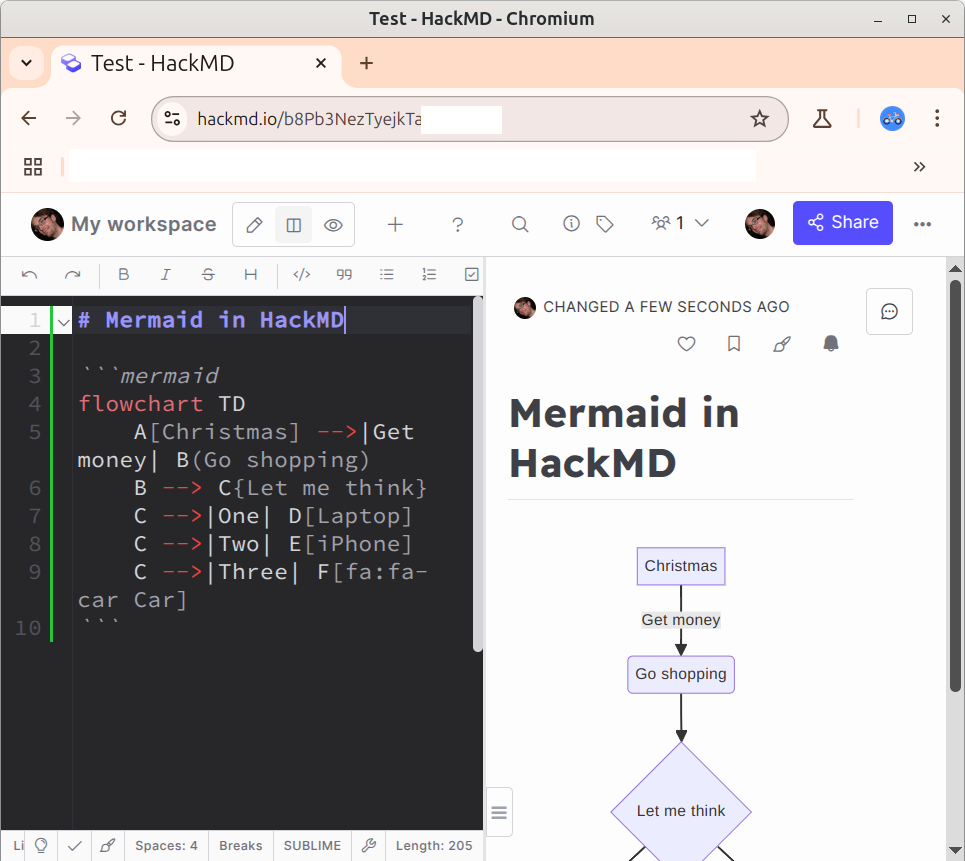

# Lesson plan 2025-04-09

- [Lesson plan](../../lesson_plans/20250410/README.md)
- [Evaluation](../../evaluations/20250410/README.md)
- [Reflection](../../reflections/20250410/README.md)

- [x] Look at last reflection
    - [ ] Prepare what yes/no to discuss

I noticed I've remove a session where I talk about myself.
I don't miss it. I feel it is not missing.
I do know I should introduce myself.
However, what about I set a limit:

- if a course is longer than one half-day,
  do introduce me and my teaching methods
- else do not

- [x] [Will not use] Consider using [https://excalidraw.com/](https://excalidraw.com/)
    - One can do shared sessions, yet not typing together in a markdown document
- [ ] Consider using [https://hackmd.io/](https://hackmd.io/)
    - This works great! Sharing is easy too. The course, however, uses
      GitHub and I do think this is superior, as it has version control.
      However, HackMD is superior in doing real-time collaboration.
      Maybe do both?

This was the lesson plan in the schedule:

```mermaid
gantt
  title Lesson plan
  dateFormat X
  axisFormat %s
  Introduction : intro, 0, 5s
  Theory 1: theory_1, after intro, 10s
  Exercise 1: crit, exercise_1, after theory_1, 5s
  Feedback 1: feedback_1, after exercise_1, 5s
  Theory 2: theory_2, after feedback_1, 10s
  Exercise 2: crit, exercise_2, after theory_2, 10s
  Feedback 2: feedback_2, after exercise_2, 5s
  Break: break_1, after feedback_2, 10s
  Theory 3: theory_3, after break_1, 10s
  Exercise 3: crit, exercise_3, after theory_3, 15s
  Feedback 3: feedback_3, after exercise_3, 5s
```

I've removed it. It feels cleaner that way :-)
