# Schedule

Time|Description
----|-----------
9:00|Work
9:50|Break
10:00|Continue
10:30|End

```mermaid
gantt
  title Lesson plan
  dateFormat X
  axisFormat %s
  section Coarse setup
  Introduction : intro, 0, 5s
  Theory 1: theory_1, after intro, 5s
  Exercise 1: crit, exercise_1, after theory_1, 10s
  Feedback 1: feedback_1, after exercise_1, 5s
  Theory 2: theory_2, after feedback_1, 5s
  Exercise 2: crit, exercise_2, after theory_2, 15s
  Break 1: crit, break_1, 45, 15s
  Feedback 2: feedback_2, after break_1, 10s
  Theory 3: theory_3, after feedback_2, 10s
  Exercise 3: crit, exercise_3, after theory_3, 10s
  Feedback 3: feedback_3, after exercise_3, 5s
  Extra/Break: after feedback_3, 10s
  Break 2: crit, 105, 15s
```

## Overview of sessions

- [Intro to mermaid](../sessions/intro_to_mermaid.md)
- [Your first mermaid experience](../sessions/first_experience.md)
- [Mermaid terminology](../sessions/mermaid_terminology.md)
- [Publishing your graphs](../sessions/publishing_graphs.md)
- [Improving the layout of your graphs](../sessions/improving_layout.md)
