# Reflection 2024-04-16

I enjoy that my original schedule was not too far off.

```mermaid
gantt
  title Lesson plan
  dateFormat X
  axisFormat %s
  Introduction : 0, 5s
  Theory 1: 5, 5s
  Exercise 1: crit, 10, 5s
  Feedback 1: 15, 5s
  Theory 2: 20, 10s
  Exercise 2: crit, 30, 10s
  Feedback 2: 40, 5s
  Theory 3: 45,55
  Exercise 3: crit, 55,15s
  Feedback 3: 70,5s
  Extra/Break: 75,90
```

> The original schedule

There was, however, a bit much more talk after exercise 2, so I've changed
the schedule.

```mermaid
gantt
  title Lesson plan
  dateFormat X
  axisFormat %s
  Introduction : intro, 0, 5s
  Theory 1: theory_1, after intro, 10s
  Exercise 1: crit, exercise_1, after theory_1, 5s
  Feedback 1: feedback_1, after exercise_1, 5s
  Theory 2: theory_2, after feedback_1, 10s
  Exercise 2: crit, exercise_2, after theory_2, 10s
  Feedback 2: feedback_2, after exercise_2, 10s
  Theory 3: theory_3, after feedback_2, 10s
  Exercise 3: crit, exercise_3, after theory_3, 10s
  Feedback 3: feedback_3, after exercise_3, 5s
  Extra/Break: after feedback_3, 10s
```

> The updated schedule

I decided to start with 'Who is Richel' at the start,
including how I select learners to answer.
I shared why I do that, how to avoid it (turn of video).
I think that was a good idea and 2 out of 3 learners
turned on their camera.

Not using Zoom rooms and use a timer instead worked well.
About 6 out of 16 learners kept on their camera during working.

The course content page was prepared well.
However, I failed at settling on how to do the teaching,
as I felt the pressure from a lot of near-future teaching.
This resulted in a bit more sloppy and fuzzy teaching cycles.
For example, I did not do Feedback on Exercise 3
and I am unsure why I did not do it...?

Another mistake I made went like this:

- R: [talks on SVG]
- R: [asks to a learner what an SVG is]
- Learner does not know
- R: [thanks learners, asks learners to shout next time, discussed SVG]

The `asks learners to shout next time` felt a bit out of place
and paternalistic. I felt I could have offended the learner
by putting him on the spot too much and I felt the need to send a
private message. However, the learners came across as being fine,
judged from more plenary dialog later on.

All in all, I think it was a good session, as the learners had enough
time to spend on exercises and most criticism on me may be details to others.

Within the course, I can imagine it is more useful to teach this earlier,
as it allows people to sketch a graph.
