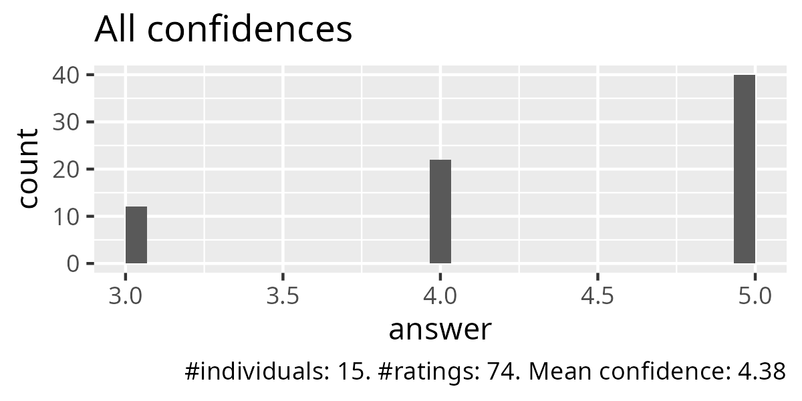
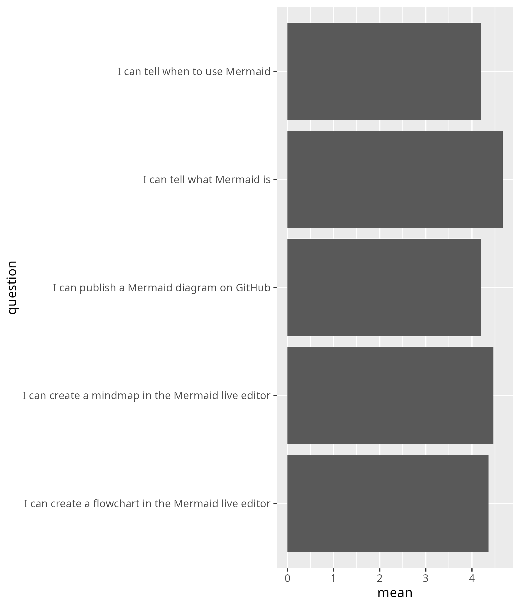
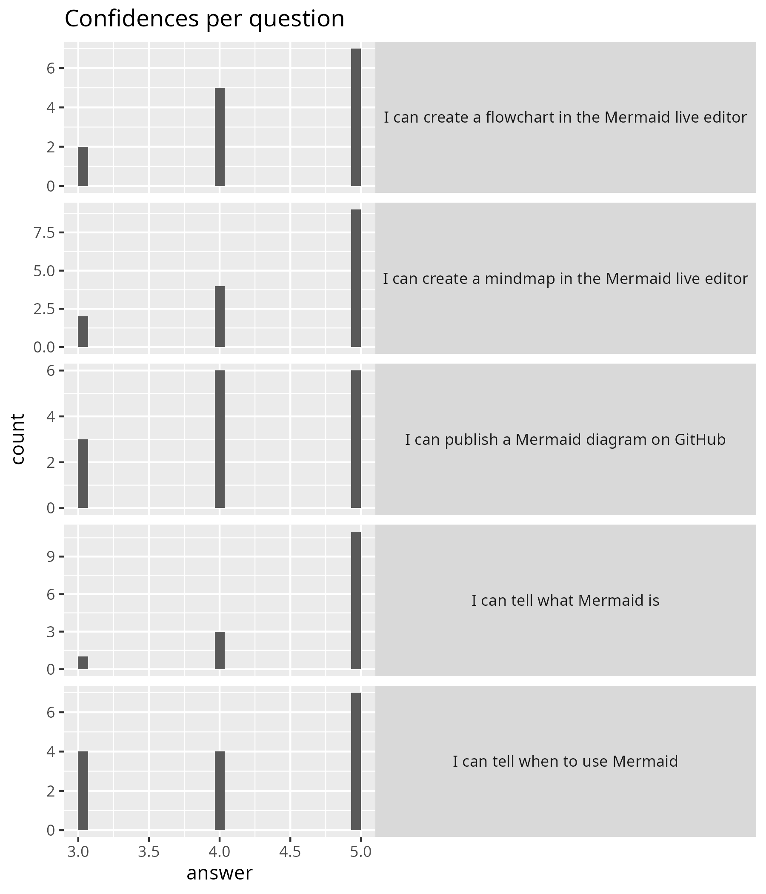

# Reflection 2025-04-10

- [Lesson plan](../../lesson_plans/20250410/README.md)
- [Evaluation](../../evaluations/20250410/README.md)
- [Reflection](../../reflections/20250410/README.md)
- [Success score](../../evaluations/20250410/success_score.txt): 88%
- Number of learners: 15
- Number of evaluation responses: 15 (100%)

I enjoyed working with the group.
I've seen half of the groups have fun by making Mermaid graphs
and had short chats with most of them.

I was hesitant to put them in groups of 2, but I just mindlessly
followed the pedagogic literature and did so. It was the right
choice.

My biggest mistake was a planning mistake: instead of having a break
from 9:50-10:00, I gave them a break from 9:50-10:10.
As I already said so, I stuck with that too long break.
Due to this, there was not enough time for the GitHub exercise at all.
I did improvise by asking people with a GitHub account to demonstrate.
These three learners did so and did have enough time to publish a
mermaid graph, so that is at least something. But it was not a
complete session at all :-/

Next time, only do mindmap and flowchart: it gives a lot of air to the course
that the learners can use. I expect that the learners write down that they
needed more time, and I already agree. Note that I already simplified the
course material to have more time for exercises.

- [x] Use schedule below

Time |Description
-----|-----------
9:00 |Your first Mermaid experience
9:40 |Mermaid terminology
9:50 |Break (keep BO rooms open)
10:00|Continue and (optional) Publishing your graphs
10:20|[Evaluation](evaluation.md) and short break
10:30|End

## Evaluation results

)

- Nice course, great energy :)
- is nice to do exercises together, they were well planned and organised.
  much better than a boring ppt
- I have enjoyed this course.
  I have learned to use different softwares and improved in my visual
  presentations. I would recommend this course to other PhD students.
- Great way to learn about this tool!
  I think it could maybe be improved by
  making it more relevant to our own research.

Great idea! I change the focal topic to 'Your own research'

- [x] For the mindmap and flowchart, use your own research as
  the topic to associate on

- It is a really useful course, and interactive.
- Great session! it was very dynamic and hands on.
  The instructor's teaching style is also very nice.
- Interactive session. Like it!
- Nice and clear structure. Enough time for most exercises.
  I like the small break-out rooms.
  No need to explicitly suggest how to interact in the break out rooms.
  I understand the wish for people to turn on camera
  but would prefer it to be voluntary still.

I think 'No need to explicitly suggest how to interact in the break out rooms'
is interesting: I do this because other people get stressed out because
of not being able to say 'Let's read first'. I guess this learner has
no problems with saying so. I agree that such things should not need
saying, but I feel in practice -when working with people from many
different cultures- I need to do so.

The 'I understand the wish for people to turn on camera
but would prefer it to be voluntary still' is another good point.
And I should have been more clear with my camera policy here:
I simply forgot to say 'If it makes you too uncomfortable, please
keep off your camera'. Agreed!

- [ ] Don't forget: learners are allowed to not have a camera on
