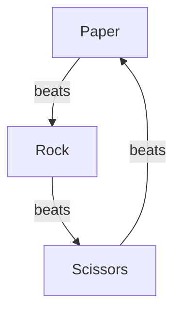
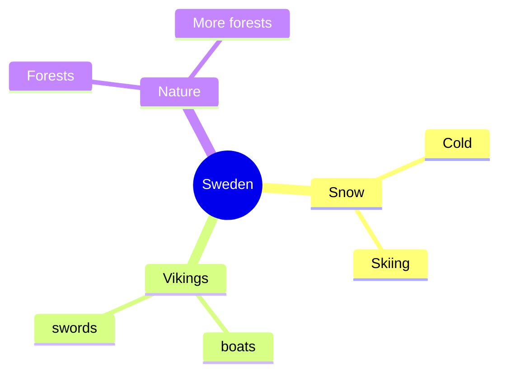

# First experience with Mermaid

!!! info "Learning outcomes"

    - Learners get a first impression of what Mermaid is
    - Learners have practiced with the Mermaid editor
    - Learners may have seen a technical error

???- question "For teachers"

    Lesson plan:

    - Prior knowledge:
        - What is a graph?
        - What do you associate the word 'graph' with?
        - What do you associate the word 'mindmap' with?
        - When could you use a mindmap?
        - How would you create a mindmap?
    - Present:
        - what is Mermaid?
        - why use Mermaid?
        - go to <mermaid.live>, show flowchart, show syntax
    - Challenge: exercise 2
    - Feedback: ask 1 random learner to show mindmap

## Why use Mermaid?

You want to express the rules for the game
[Rock Paper Scissors](https://en.wikipedia.org/wiki/Rock_paper_scissors)
in a graph.

In 1 minute you create this graph:



Mermaid allows you to create such graphs.
Sometimes, these are good enough, sometimes they are used as a
first draft for a more pretty graph.

Instead of talking about it, let's experience Mermaid first.

## Exercises

### Exercise 1: first experience

???- question "Need a video?"

    Here is a video of someone doing this exercise: [https://youtu.be/tObmaZp3fIg](https://youtu.be/tObmaZp3fIg)



> An example Mermaid mindmap, with associations to 'Sweden'.

In this exercise, we'll be making a mindmap
of your associations with a topic of your choice.

- Go to [https://mermaid.live](https://mermaid.live)
- Click on 'Sample Diagrams' then click 'Mindmap'
- Modify the mindmap so that the topic to associate on
  (e.g. 'Graphs' or 'Sweden' or 'Using a computer') is at the center.
- Modify the mindmap so that it shows your associations with that word
  visually.
  When you feel you are done, you are done.
- **Scan** (not read entirely!)
  [the Mermaid documentation on mindmaps](https://mermaid.js.org/syntax/mindmap.html)
  and use one feature

???- question "Answer"

    This is example for the topic 'Graphs':

    ```mermaid
    mindmap
      root((Graphs))
        Images that convey information
          work on data
          **self-contained**
        Types
          **Mindmap**
          Flowchart
          Gantt chart
        Tools
          **mermaid.live**
          Visual programs
          **Text editor**
        Defined/created by ...
          A markup language
            DOT
            SVG
            **Mermaid**
          WYSIWYG
    ```

### Exercise 2: theory

- What can you express in a Mermaid mindmap?

???- question "Answer"

    A Mermaid mindmap allows one to create a tree-like structure
    of vertices/nodes/concepts in an outwards way.

- What can you not express in a Mermaid mindmap?

???- question "Answer"

    One cannot add links between concepts.
    One cannot determine where the nodes will end up.

- (optional) What happens if you do use the word `mindmap` in your mindmap?

???- question "Answer"

    You will get an error, as `mindmap` is a word that Mermaid reserves for
    indicating that a graph will be of the mindmap type.

- (optional) Are there characters forbidden, such as `.`, `!`, `[` or `(`?

???- question "Answer"

    You will get an error for `[` and `(`, as Mermaid uses these operators
    for special markup.
