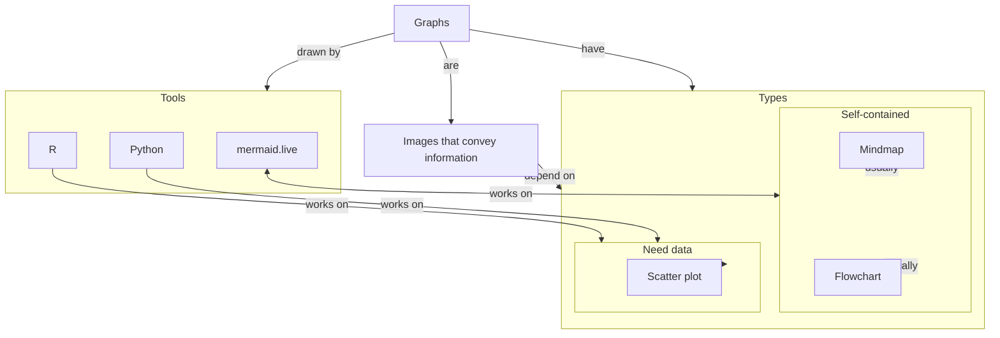
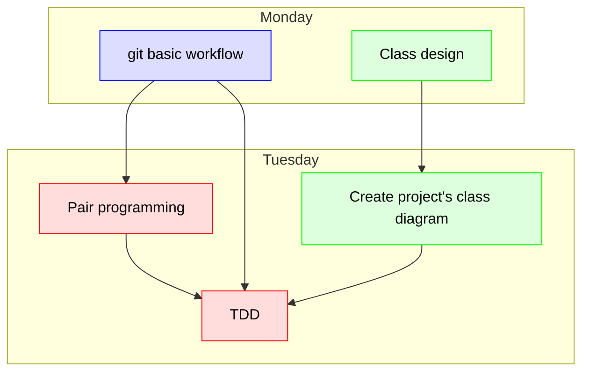

# Improving the layout of a mermaid graph

???+ info "Learning objectives"

    - Learners understand what Mermaid is
    - Learners have practiced with the Mermaid editor
    - Learners have uploaded a Mermaid diagram to a GitHub README.md file
    - Learners have improved the layout of a flowchart using subgraphs

Mermaid is a markup language to create graphs.

## subgraphs

From the markup text,
Mermaid uses algorithms to make a graph look pretty.
However, sometimes this does not work out.

One solution in flowcharts is to use subgraphs:

````text

````

## Coloring nodes

Coloring the nodes can be helpful.
Mermaid allows one to define a style (technically: a class definition)
and apply it to nodes:

````text

````

### Exercise: improve layout

Try to create a prettier graph using subgraphs
and colored nodes.
Pick any topic you want.

