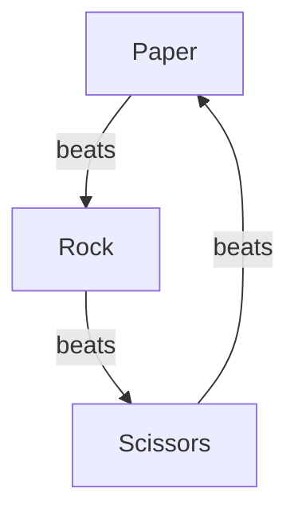
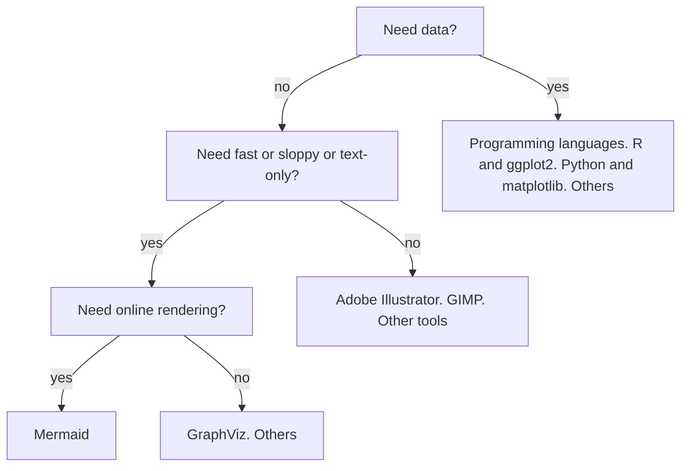

# Intro to mermaid

???- info "Learning objectives"

    - Learners understand what Mermaid is
    - Learners understand when to consider Mermaid
    - Learners have practiced with the Mermaid editor to create a mindmap
    - Learners have practiced with the Mermaid editor to create a flowchart
    - Learners have uploaded a Mermaid diagram to a GitHub README.md file
    - Learners have improved the layout of a flowchart using subgraphs

???- info "For teachers"

    ```mermaid
    gantt
      title Lesson plan
      dateFormat X
      axisFormat %s
      section Coarse setup
      Introduction : intro, 0, 5s
      Theory 1: theory_1, after intro, 5s
      Exercise 1: crit, exercise_1, after theory_1, 10s
      Feedback 1: feedback_1, after exercise_1, 5s
      Theory 2: theory_2, after feedback_1, 5s
      Exercise 2: crit, exercise_2, after theory_2, 15s
      Break 1: crit, break_1, 45, 15s
      Feedback 2: feedback_2, after break_1, 10s
      Theory 3: theory_3, after feedback_2, 10s
      Exercise 3: crit, exercise_3, after theory_3, 10s
      Feedback 3: feedback_3, after exercise_3, 5s
      Extra/Break: after feedback_3, 10s
      Break 2: crit, 105, 15s
    ```

    Lesson plan:

    - Who I am
    - Cycle 1:
        - Prior knowledge:
            - What do you associate the word 'diagram' with?
            - What types of diagrams are there? Mention mindmap and flowchart
            - How to create diagrams?
            - How to publish diagrams?
            - What is a mindmap?
            - How to create a mindmap?
        - Present: go to <mermaid.live>, show mindmap, show syntax
        - Challenge: exercise 1
        - Feedback:
            - ask 1 random learner to show mindmap, else show mine
            - ask drawback of mindmaps. Cannot link between nodes
    - Cycle 2:
        - Prior knowledge:
            - What do you associate the word 'flowchart' with?
            - How to create a flowchart?
        - Present:
            - what is mermaid?
            - why use mermaid?
            - go to <mermaid.live>, show flowchart, show syntax
        - Challenge: exercise 2
        - Feedback: ask 1 random learner to show mindmap

## Why

You want to express the rules for the game
[Rock Paper Scissors](https://en.wikipedia.org/wiki/Rock_paper_scissors)
in a graph.

In 1 minute you create this graph:



Mermaid allows you to create such graphs.
Sometimes, these are good enough, sometimes they are used as a
first draft for a more pretty graph.

## Bigger picture



## Overview of sessions

- [Intro to mermaid](intro_to_mermaid.md)
- [Your first mermaid experience](first_experience.md)
- [Mermaid terminology](mermaid_terminology.md)
- [Publishing your graphs](publishing_graphs.md)
- [Improving the layout of your graphs](improving_layout.md)
