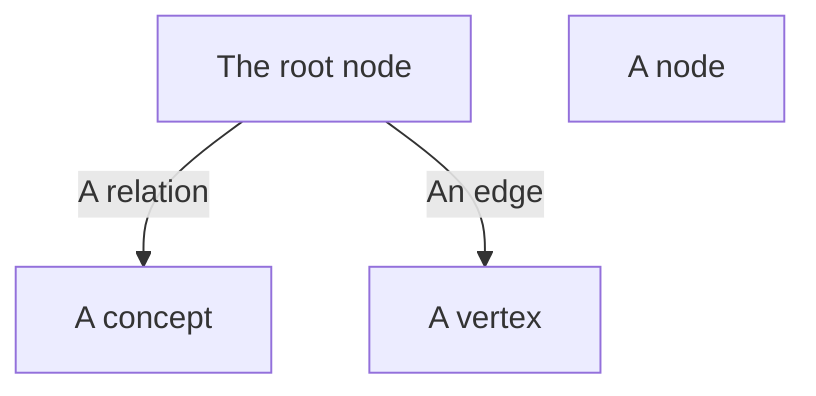
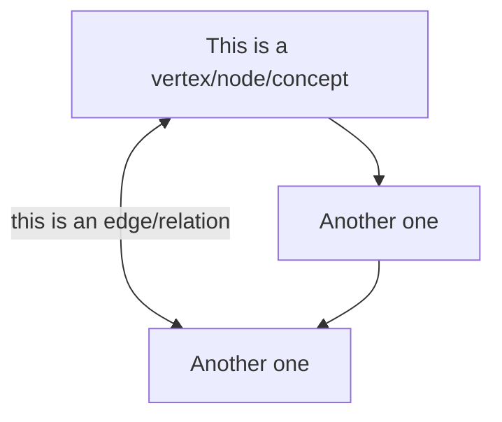

# mermaid terminology

???- info "Learning objectives"

    - Learners understand what Mermaid is
    - Learners have practiced with the Mermaid editor

???- info "For teachers"

    Lesson plan:

    - Prior knowledge:
        - What is a markup language?
        - Can you give examples of markup languages?
        - Why use markup languages?
        - What is a graph in this context?
        - What are properties of a graph?
        - What is a graph root?
        - What is a graph concept?
        - What is a graph node?
        - What is a graph vertex?
        - What is a graph relation?
        - What is a graph edge?
    - Present:
        - What is a markup language?
        - Why use a markup language?
    - Challenge: exercise
    - Feedback: ask 1 random learner to show mindmap

Mermaid is a markup language to create graphs.

A markup language is a language that describes the markup of something.
Typically, this involves you writing down the structure
of how things should look like,
where software will take care of the details.
A markup language allow you to store knowledge in plain text that is friendly
to both humans and computers.

In case of a mindmap, the Mermaid markup language uses indentation
to indicate the structure of the mindmap.

The [https://mermaid.live](https://mermaid.live) website is an online editor
with direct visualization.

Mermaid will do the layout for you.
Options to decide upon the layout are absent or limited.
This is a strength: you **should** let Mermaid do the layout for you,
as the goal is to create graphs quickly, not to create graphs for publication.



> Graph terminology:
> The 'circles with text' can be called a node, a concept or a vertex.
> The 'lines between things' can be called a relation or an edge.

A mindmap is a graph that does not have relations between its
nodes/vertices/concepts.
For complex information, however, one would enjoy to express this
by adding edges/relations.
A mermaid flowchart allows one to create graphs of a complex structure.



## Exercise: a flowchart

???- question "Need a video?"

    Here is a video of someone doing this exercise: [https://youtu.be/I9UI7DUM81k](https://youtu.be/I9UI7DUM81k)

What do you associate with the word 'graph'?

- Go to [https://mermaid.live](https://mermaid.live)
- Click on 'Sample Diagrams' then click 'Flow'
- Modify the flowchart so that the word 'Graphs' is at the center
- If needed, visit [the Mermaid documentation on flowcharts](https://mermaid.js.org/syntax/flowchart.html)
- (optional) On the edges, describe the relationships between the concepts.

Questions:

- What can you express in a Mermaid flowchart?

???- question "Answer"

    A Mermaid flowchart allows one to create a complex structure
    of vertices/nodes/concepts in any way

- What can you not express in a Mermaid flowchart?

???- question "Answer"

    One cannot determine where the nodes will end up.

???- question "My associations with the word 'graph' as a flowchart"

    ```mermaid
    flowchart TD
      graphs[Graphs]
      images[Images that convey information]
      self_contained[Self-contained]
      need_data[Need data]
      types[Types]
      scatter_plot[Scatter plot]
      mindmap[Mindmap]
      a_flowchart[Flowchart]
      tools[Tools]
      mermaid_live[mermaid.live]
      python[Python]
      r[R]

      graphs --> |are| images
      images --> |may be| self_contained
      images --> |may be| need_data

      graphs --> |have| types
      types --> |for example| mindmap
      types --> |for example| a_flowchart    
      types --> |for example| scatter_plot
      mindmap --> |usually| self_contained
      a_flowchart --> |usually| self_contained
      scatter_plot --> need_data

      graphs --> |drawn by| tools
      tools --> |for example| mermaid_live
      tools --> |for example| python
      tools --> |for example| r

      mermaid_live <--> |works on|self_contained
      python --> need_data
      r --> need_data
    ```
