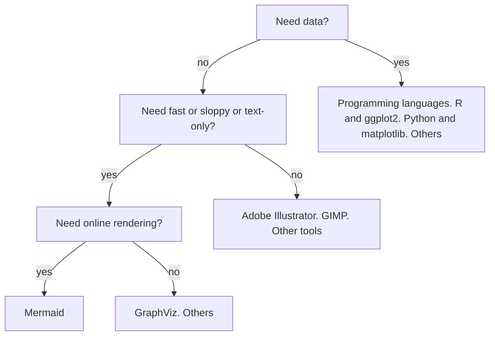

# Publishing Mermaid graphs

!!! info "Learning outcomes"

    - Learners understand what Mermaid is
    - Learners have practiced with the Mermaid editor
    - Learners have uploaded a Mermaid diagram to a GitHub README.md file


# When to use Mermaid?

<!-- markdownlint-disable MD013 -->



<!-- markdownlint-enable MD013 -->

# Why to use GitHub?

Mermaid is a markup language to create graphs.

One probably wants to share these graphs.

GitHub is a website primarily to host code.
It is the current most popular code hosting website
and host more than only code.
Per project, a typical user creates one website,
called a GitHub repository.
All GitHub repositories are version controlled,
i.e. one can always go back in history to recover
(older versions of) files.

## Exercise: publish a graph

???- question "Need a video?"

    Here is a video of someone doing this exercise: [https://youtu.be/OcZvo8Y5hzE](https://youtu.be/OcZvo8Y5hzE)

Here we publish a Mermaid graph on GitHub.
In this exercise, the graph is unimportant: pick your favorite :-)

- Create a GitHub account at [https://github.com](https://github.com)
- Create a new GitHub repository and add a check to 'Create README.md'
- Your own GitHub repository now shows its `README.md` file
- Edit the file `README.md`
- In the editor, put your Mermaid markdown in a Mermaid code block,
  like this website does:

````text
```mermaid
[your Mermaid code here]
```
````

- Click on 'Commit'
- Refresh the website: it shows your Mermaid graph!
