# Lesson plan 2024-04-16

Here is the schedule:

```mermaid
gantt
  title Lesson plan
  dateFormat X
  axisFormat %s
  Introduction : 0, 5s
  Theory 1: 5, 5s
  Exercise 1: crit, 10, 5s
  Feedback 1: 15, 5s
  Theory 2: 20, 10s
  Exercise 2: crit, 30, 10s
  Feedback 2: 40, 5s
  Theory 3: 45,55
  Exercise 3: crit, 55,15s
  Feedback 3: 70,5s
  Extra/Break: 75,90
```

I decide to start with 'Who is Richel' at the start.

Most of the preparations is put at the course content page,
so I won't repeat it here.

Instead of using Zoom rooms, I will set a timer and make
the learners study in silence.

I aim to use the teaching cycle of Mike Bell.
